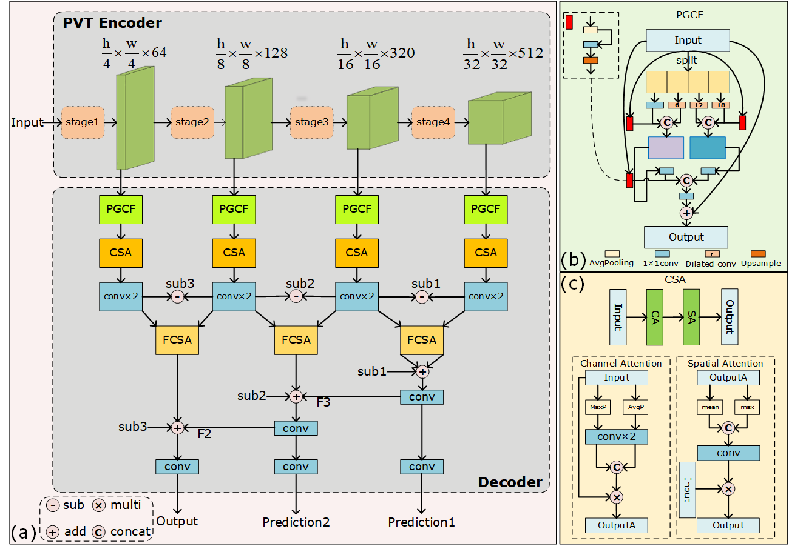
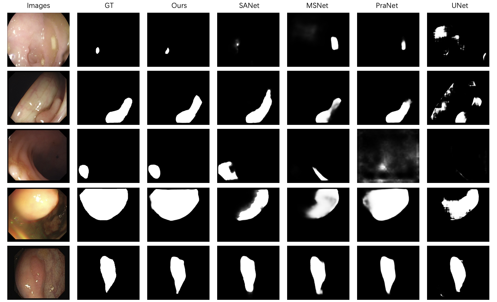
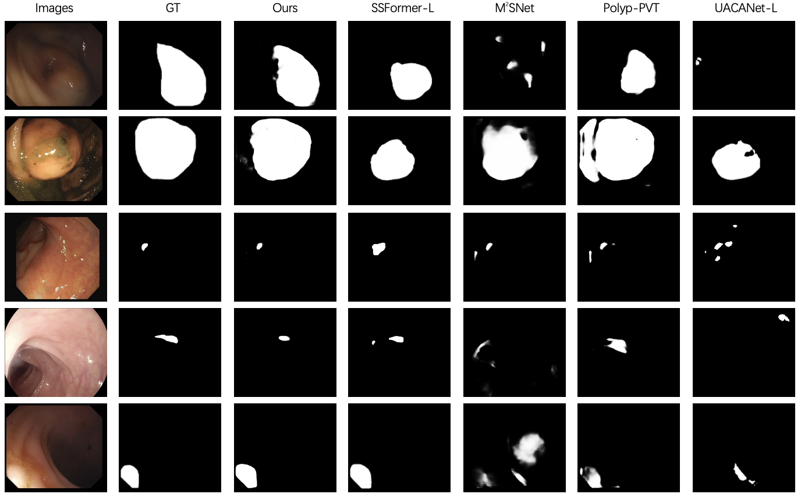

# Progressive Group Convolution Fusion Network for Colon Polyp Segmentation

## 1. Abstract

In the field of medical imaging, the automatic detection and segmentation of colon polyps is particularly crucial for the early diagnosis of colorectal cancer. However, existing methods often face limitations when processing polyp images, especially under low-contrast and blurred boundary conditions, which hinder the recognition of complex features and thus affect the accuracy and efficiency of diagnosis. The challenge is further compounded by a lack of flexibility and precision in differentiating polyps of various sizes and shapes. To address these challenges, this study presents an advanced segmentation method that integrates a Pyramid Vision Transformer (PVT) encoder with a Convolutional Neural Network (CNN) decoder. The encoder, which utilizes the multi-level transformer modules of the PVT, effectively captures the intricate details and contextual information of the image, enabling precise extraction of complex features within polyp images. The decoder incorporates a Progressive Grouped Convolutional Fusion (PGCF) module that extracts multi-scale features through dilated convolutional kernels with different dilation rates. Coupled with attention mechanisms and differential subtraction strategies, our method not only enhances the feature fusion capability but also significantly improves the delineation of polyp boundaries. By integrating the PGCF module, differential operations, and multi-scale fusion strategies, our approach overcomes the limitations of existing colon polyp segmentation techniques. Experimental results on a large-scale annotated colon polyp image dataset show that our method demonstrates excellent performance and robustness in localizing and segmenting polyps of diverse sizes, shapes, and textures.

## 2. Architecture

## 3. Implementation
The proposed architecture is implemented using the PyTorch framework (1.7.1+cu101) with 2 NVIDIA Tesla T4 with 16 GB Memory. 

### 3.1 Dataset

+ downloading testing dataset, which can be found in this [download link (Google Drive)](https://drive.google.com/file/d/1hwirZO201i_08fFgqmeqMuPuhPboHdVH/view?usp=sharing). It contains five sub-datsets: CVC-300 (60 test samples), CVC-ClinicDB (62 test samples), CVC-ColonDB (380 test samples), ETIS-LaribPolypDB (196 test samples), Kvasir (100 test samples).

+ downloading training dataset , which can be found in this [download link (Google Drive)](https://drive.google.com/file/d/1hzS21idjQlXnX9oxAgJI8KZzOBaz-OWj/view?usp=sharing). It contains two sub-datasets: Kvasir-SEG (900 train samples) and CVC-ClinicDB (550 train samples).

+ downloading pvtv2 weights , which can be found in this [download link (Google Drive)](https://https://drive.google.com/drive/folders/1Eu8v9vMRvt-dyCH0XSV2i77lAd62nPXV). 

## 3. Results
### 3.1 Comparative Visualization of Lower-Accuracy Segmentation Methods on five datasets.

### 3.2 Comparative Visualization of Higher-Accuracy Segmentation Methods on five datasets.

## 4. Citation
<pre>
######
</pre>

## 5. License
The source code is free for research and education use only. Any comercial use should get formal permission first.
